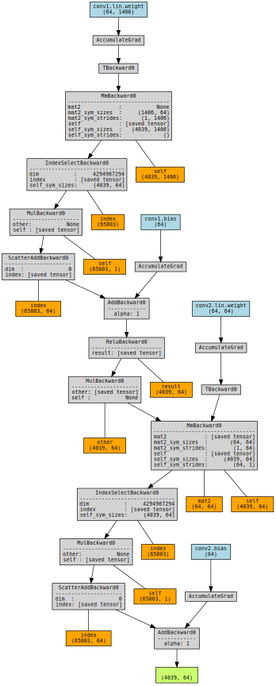

# Friend Recommendation using Graph Neural Networks in Social Platforms
##   Authors 
- V.Karaiskos, ID: 480, [vkaraiskos\@cs.uoi.gr](mailto:vkaraiskos@cs.uoi.gr)
- V.Tsolis,    ID: 502, [pcs00502\@uoi.gr](mailto:pcs00502@uoi.gr)
## Description
The proliferation of online social platforms has reshaped interpersonal interactions, emphasizing the significance of effective friend-recommendation systems. This study delves into the realm of friend recommendation within social networks, focusing on the utilization of Graph Convolutional Networks (GCNs) to address the challenges posed by large-scale social graphs. Leveraging extensive experiments on datasets from prominent social platforms, namely Facebook and Twitter, we investigated the performance of GCNs compared to a baseline Truncated Singular Value Decomposition (tSVD) model. Our findings underscore the superiority of GCNs over tSVD in early and intermediate friendship recommendation tasks, demonstrating higher accuracy (up to 18% gains) and better ranking relevancy in both the early (up to 109% hit rate, 100% NDCG, and 115% MRR gains) and intermediate (up to 98% hit rate, 83% NDCG, and 86% MRR gains) stages. We observed a correlation between the model accuracy and ranking relevancy across different training epochs, with an optimal threshold for training epochs of approximately 200 epochs. Challenges persist, particularly in addressing the multifaceted nature of social network graphs. Future research could explore more complex model architectures and innovative preprocessing techniques to enhance recommendation accuracy and alleviate data sparsity issues. Overall, our study highlights the potential of GCNs as effective tools for friend recommendations, suggesting avenues for further exploration and improvement in personalized recommendation systems within social platforms.

